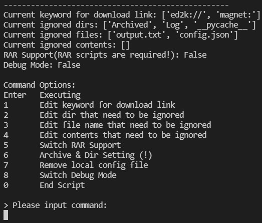

# Download Link Reader

----

[1]: https://img.shields.io/badge/Issue-Welcome-brightgreen
[2]: https://github.com/Neurotoxin0/OpenWrt/issues/new
[3]: https://img.shields.io/badge/PRs-Welcome-brightgreen
[4]: https://github.com/Neurotoxin0/OpenWrt/pulls

[![Issue Welcome][1]][2]
[![PRs Welcome][3]][4]
- [中文版](https://github.com/Neurotoxin0/Download_Link_Reader/blob/main/README_EN.md "中文版")

----

#### A Python script that reads all txt files in current dir to looking for downloadable links
- Supported & Tested Features: 
    * Auto unzip single-zipped "zip" file in working dir and its sub dirs
    * Walkthrough dirs and sub-dirs in working dir
    * Write all links found into output.txt
    * Strip empty line from the output file
    * Ignore list: ignore certain dirs, file names ,and specific contents
    * Use time stamp to separate each run
    * Counter: processed file + links found
    * Add support for files with Chinese character(UTF-8)
    * Detailed Log on which zip files and txt files were processed or ignored
    * Detailed CLI added
    * Language Support: Chinese & English
    * Auto Archive Processed Files
    * Add Support For RAR File(Manually Install RAR Scripts to Python)

----

#### Sample:

